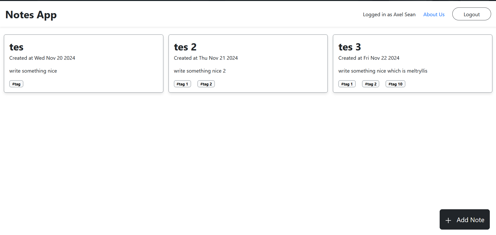

# notes-app-react



This is a React notes app project bootstrapped with [Vite](https://vitejs.dev/). It provides a fast development environment for building modern React applications.

---

## 📝 Features

- ⚡ Built with [Vite](https://vitejs.dev/) for a super-fast development experience.
- 🛠️ React 18 for building modern UI components.
- 🎨 CSS/SCSS support for styling.
- 📦 ESM support for optimal build performance.
- 🔥 Hot Module Replacement (HMR) for instant updates during development.

---

## 🚀 Getting Started

Follow these steps to get the project up and running on your local machine:

### Prerequisites

- Node.js (version 14 or later)
- npm or yarn (choose one package manager)

### Installation

1. Clone the repository:

   ```bash
   git clone https://github.com/AxelSeanCP/notes-app-react
   ```

2. Navigate to the project directory:

   ```bash
   cd notes-app-react
   ```

3. Install the dependencies:

   Using npm:

   ```bash
   npm install
   ```

   Using yarn:

   ```bash
   yarn install
   ```

---

## 📦 Available Scripts

### Development Server

To start the development server, run:

```bash
npm run dev
# OR
yarn dev
```

This will start a local development server, typically accessible at `http://localhost:5173`.

### Build

To create a production build, run:

```bash
npm run build
# OR
yarn build
```

The optimized production build will be output to the `dist/` folder.

### Preview

To preview the production build locally, run:

```bash
npm run preview
# OR
yarn preview
```

This will serve the `dist/` folder for testing.

---

## 📁 Project Structure

```plaintext
.
├── src/               # Source files
│   ├── assets/        # Images, icons, and other assets
│   ├── components/    # Reusable React components
│   ├── pages/         # Page-level components
│   ├── App.jsx        # Main React app component
│   ├── main.jsx       # Entry point for React
├── .gitignore         # Files to ignore in Git
├── index.html         # Entry HTML file
├── package.json       # Dependencies and scripts
├── vite.config.js     # Vite configuration file
└── README.md          # Project documentation
```

---

## 🌐 Deployment

To deploy the project, use any static hosting service (e.g., Vercel, Netlify, GitHub Pages). Here's how to deploy:

1. Build the project:

   ```bash
   npm run build
   ```

2. Upload the contents of the `dist/` folder to your hosting service.

---

## 🛠️ Technologies Used

- **React** - JavaScript library for building user interfaces.
- **Vite** - Lightning-fast frontend build tool.
- **Bootstrap 5** - For styling the application.

---

## 👷‍♂️ Contributing

Contributions are welcome! If you'd like to contribute, please:

1. Fork the repository.
2. Create a new branch.
3. Make your changes.
4. Open a pull request.

---

## 🐛 Issues

If you encounter any issues or bugs, please feel free to open an issue in the repository.

---

## 🙌 Acknowledgments

Thanks to the Bootstrap, Vite and React communities for providing amazing tools for frontend development.

---
